# State Machine Diagrams

Diagrammes d'états des composants principaux de l'application esports-tracker.

---

## 1. Two-Factor Authentication Setup

**Fichier:** `src/components/auth/TwoFactorSetup.tsx`

Assistant multi-étapes pour activer/désactiver la 2FA.

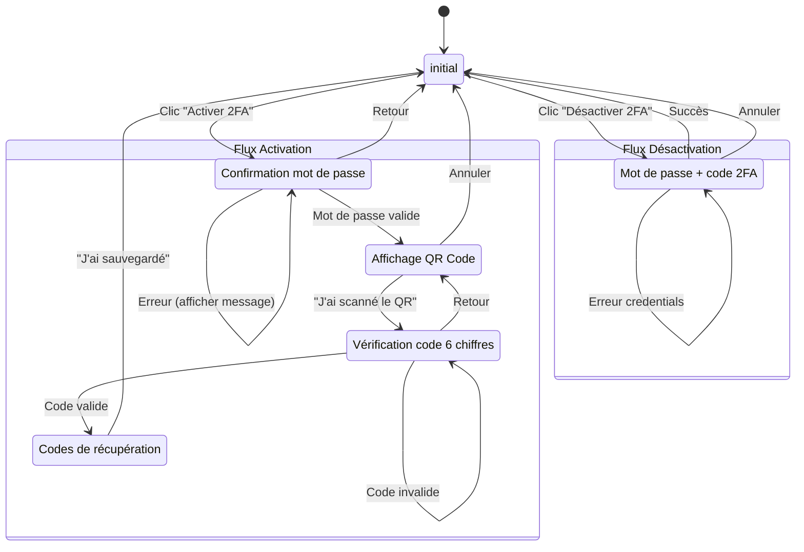
```mermaid
stateDiagram-v2
    [*] --> initial

    initial --> qrcode_password: Clic "Activer 2FA"
    initial --> disable: Clic "Désactiver 2FA"

    state "Flux Activation" as EnableFlow {
        qrcode_password: Confirmation mot de passe
        qrcode_display: Affichage QR Code
        verify: Vérification code 6 chiffres
        complete: Codes de récupération
    }

    qrcode_password --> qrcode_display: Mot de passe valide
    qrcode_password --> qrcode_password: Erreur (afficher message)
    qrcode_password --> initial: Retour

    qrcode_display --> verify: "J'ai scanné le QR"
    qrcode_display --> initial: Annuler

    verify --> complete: Code valide
    verify --> verify: Code invalide
    verify --> qrcode_display: Retour

    complete --> initial: "J'ai sauvegardé"

    state "Flux Désactivation" as DisableFlow {
        disable: Mot de passe + code 2FA
    }

    disable --> initial: Succès
    disable --> disable: Erreur credentials
    disable --> initial: Annuler
```

### États d'erreur détaillés

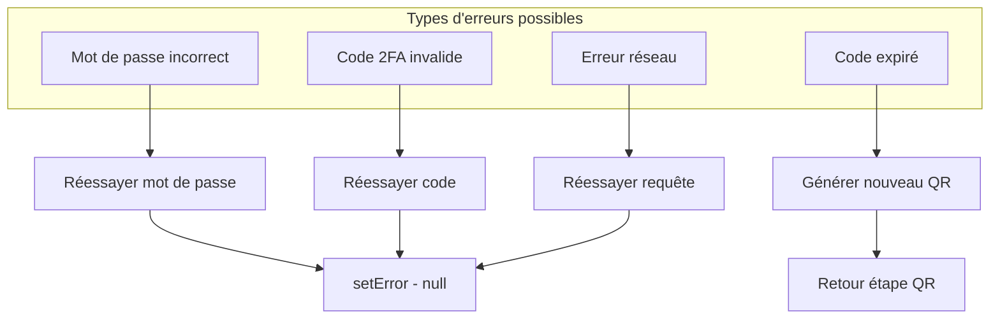
```mermaid
flowchart TD
    subgraph Erreurs["Types d'erreurs possibles"]
        E1[Mot de passe incorrect]
        E2[Code 2FA invalide]
        E3[Code expiré]
        E4[Erreur réseau]
    end

    E1 --> R1[Réessayer mot de passe]
    E2 --> R2[Réessayer code]
    E3 --> R3[Générer nouveau QR]
    E4 --> R4[Réessayer requête]

    R1 --> Clear[setError - null]
    R2 --> Clear
    R3 --> Reset[Retour étape QR]
    R4 --> Clear
```

---

## 2. Authentication Context

**Fichier:** `src/contexts/AuthContext.tsx`

État d'authentification global.

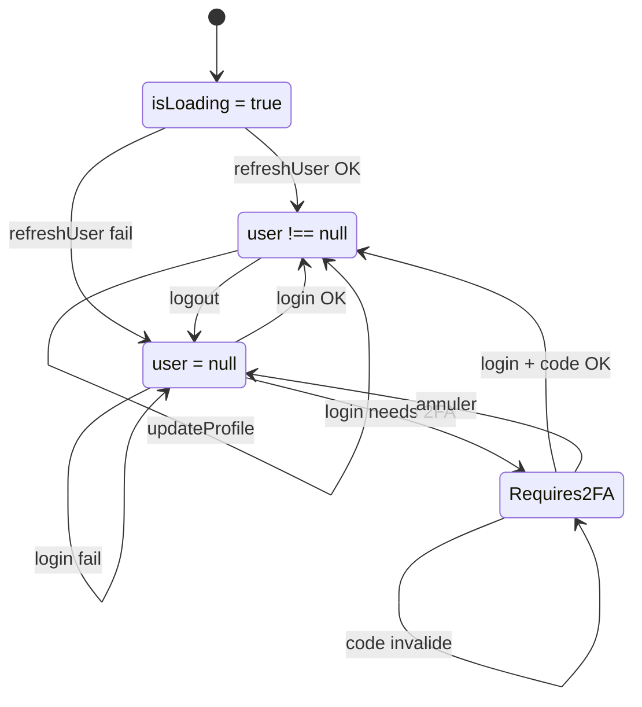
```mermaid
stateDiagram-v2
    [*] --> Loading

    Loading: isLoading = true
    Authenticated: user !== null
    Unauthenticated: user = null

    Loading --> Authenticated: refreshUser OK
    Loading --> Unauthenticated: refreshUser fail

    Unauthenticated --> Authenticated: login OK
    Unauthenticated --> Unauthenticated: login fail
    Unauthenticated --> Requires2FA: login needs 2FA

    Requires2FA --> Authenticated: login + code OK
    Requires2FA --> Requires2FA: code invalide
    Requires2FA --> Unauthenticated: annuler

    Authenticated --> Unauthenticated: logout
    Authenticated --> Authenticated: updateProfile
```

### Gestion des erreurs de login

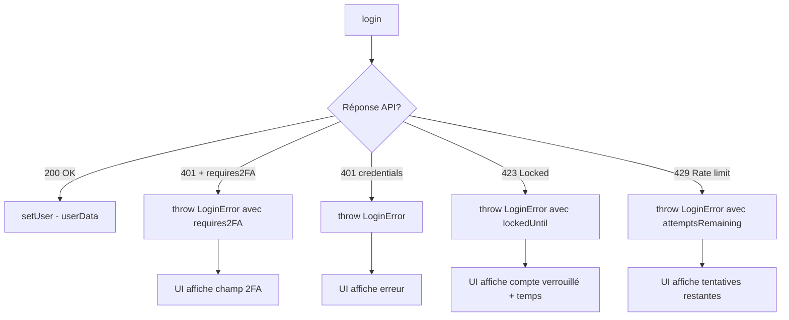
```mermaid
flowchart TD
    A[login] --> B{Réponse API?}

    B -->|200 OK| C[setUser - userData]
    B -->|401 + requires2FA| D[throw LoginError avec requires2FA]
    B -->|401 credentials| E[throw LoginError]
    B -->|423 Locked| F[throw LoginError avec lockedUntil]
    B -->|429 Rate limit| G[throw LoginError avec attemptsRemaining]

    D --> H[UI affiche champ 2FA]
    E --> I[UI affiche erreur]
    F --> J[UI affiche compte verrouillé + temps]
    G --> K[UI affiche tentatives restantes]
```

---

## 3. Dashboard Store - Périodes

**Fichier:** `src/stores/dashboardStore.ts`

Gestion des périodes temporelles.

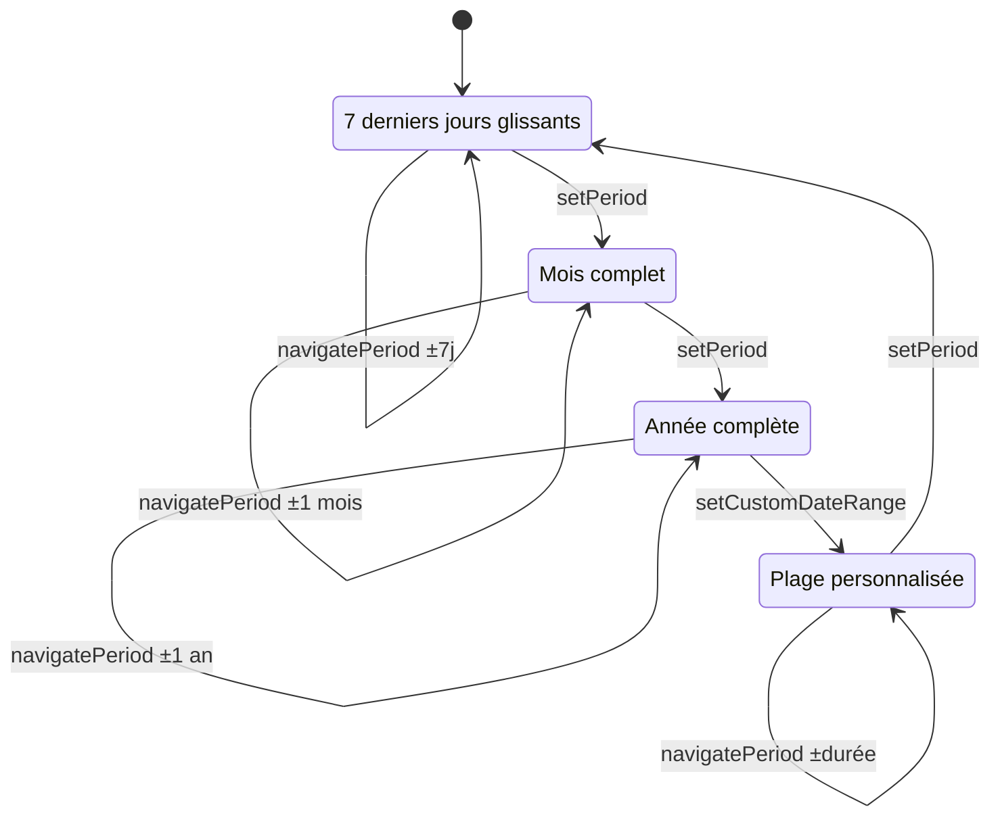
```mermaid
stateDiagram-v2
    [*] --> day

    day: 7 derniers jours glissants
    month: Mois complet
    year: Année complète
    custom: Plage personnalisée

    day --> month: setPeriod
    month --> year: setPeriod
    year --> custom: setCustomDateRange
    custom --> day: setPeriod

    day --> day: navigatePeriod ±7j
    month --> month: navigatePeriod ±1 mois
    year --> year: navigatePeriod ±1 an
    custom --> custom: navigatePeriod ±durée
```

### Navigation des périodes

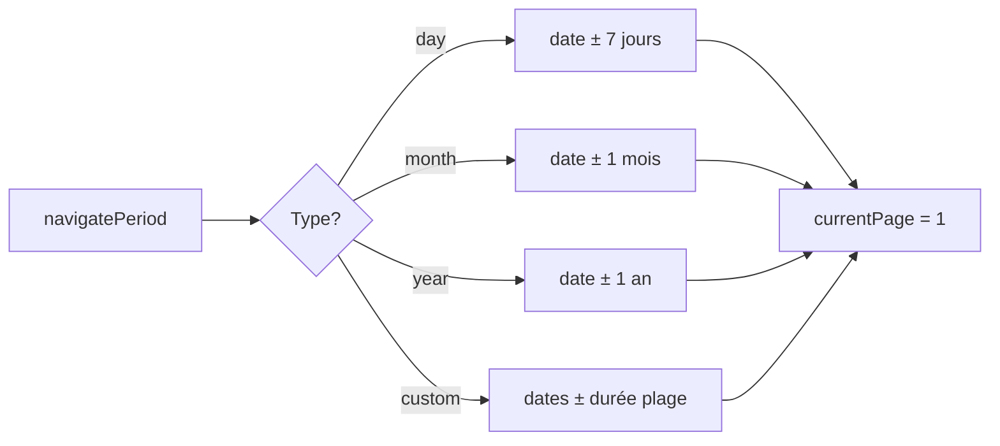
```mermaid
flowchart LR
    A[navigatePeriod] --> B{Type?}

    B -->|day| C["date ± 7 jours"]
    B -->|month| D["date ± 1 mois"]
    B -->|year| E["date ± 1 an"]
    B -->|custom| F["dates ± durée plage"]

    C --> G[currentPage = 1]
    D --> G
    E --> G
    F --> G
```

---

## 4. Dashboard Store - Sélection (max 2)

**Fichier:** `src/stores/dashboardStore.ts`

Logique de sélection avec maximum 2 éléments et verrouillage.

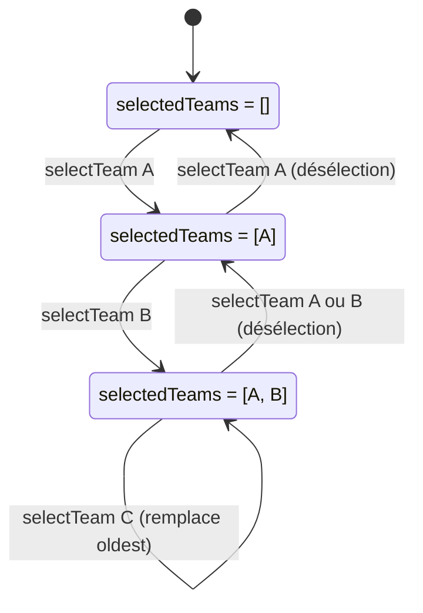
```mermaid
stateDiagram-v2
    [*] --> Vide

    Vide: selectedTeams = []
    Un: selectedTeams = [A]
    Deux: selectedTeams = [A, B]

    Vide --> Un: selectTeam A
    Un --> Vide: selectTeam A (désélection)
    Un --> Deux: selectTeam B

    Deux --> Un: selectTeam A ou B (désélection)
    Deux --> Deux: selectTeam C (remplace oldest)
```

### Algorithme de remplacement

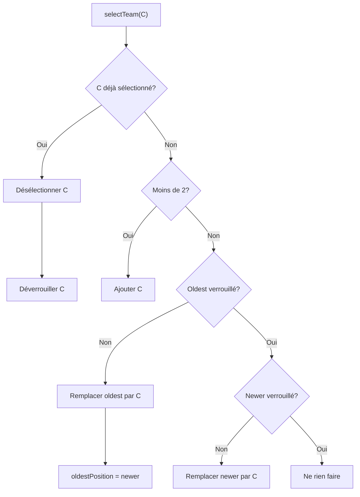
```mermaid
flowchart TD
    A["selectTeam(C)"] --> B{C déjà sélectionné?}

    B -->|Oui| C[Désélectionner C]
    C --> D[Déverrouiller C]

    B -->|Non| E{Moins de 2?}

    E -->|Oui| F[Ajouter C]

    E -->|Non| G{Oldest verrouillé?}
    G -->|Non| H[Remplacer oldest par C]
    G -->|Oui| I{Newer verrouillé?}
    I -->|Non| J[Remplacer newer par C]
    I -->|Oui| K[Ne rien faire]

    H --> L[oldestPosition = newer]
```

### États de verrouillage

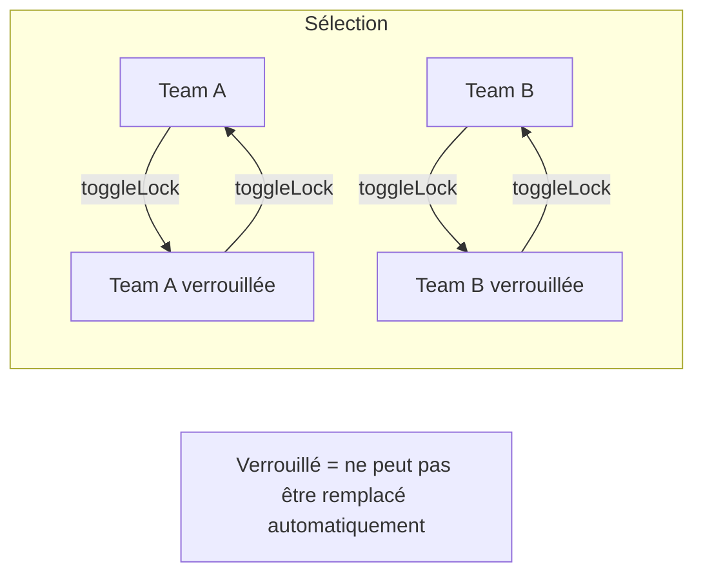
```mermaid
flowchart LR
    subgraph Sélection
        A[Team A] --> |toggleLock| A_Locked[Team A verrouillée]
        B[Team B] --> |toggleLock| B_Locked[Team B verrouillée]
    end

    A_Locked --> |toggleLock| A
    B_Locked --> |toggleLock| B

    Note1[Verrouillé = ne peut pas être remplacé automatiquement]
```

---

## 5. DateRangePicker

**Fichier:** `src/components/dashboard/DateRangePicker.tsx`

Sélecteur de plage de dates personnalisée.

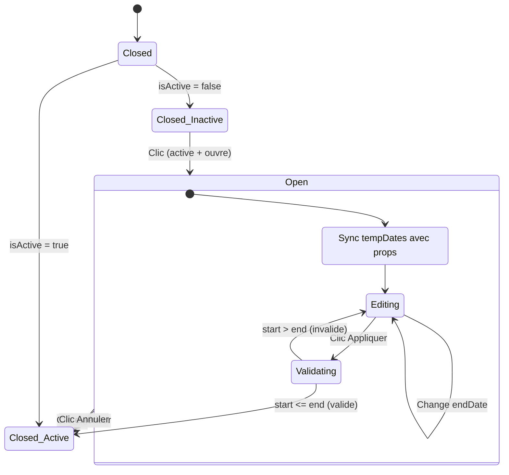
```mermaid
stateDiagram-v2
    [*] --> Closed

    Closed --> Closed_Inactive: isActive = false
    Closed --> Closed_Active: isActive = true

    Closed_Inactive --> Open: Clic (active + ouvre)
    Closed_Active --> Open: Clic

    state Open {
        [*] --> InitDates
        InitDates: Sync tempDates avec props
        InitDates --> Editing

        Editing --> Editing: Change startDate
        Editing --> Editing: Change endDate
        Editing --> Validating: Clic Appliquer
    }

    Validating --> Closed_Active: start <= end (valide)
    Validating --> Editing: start > end (invalide)

    Open --> Closed_Active: Clic extérieur
    Open --> Closed_Active: Clic Annuler
```

### Validation des dates

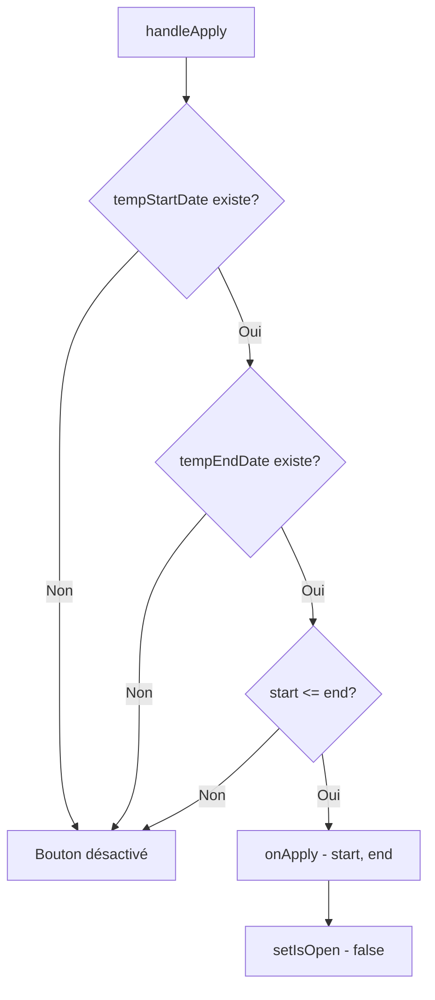
```mermaid
flowchart TD
    A[handleApply] --> B{tempStartDate existe?}
    B -->|Non| X[Bouton désactivé]
    B -->|Oui| C{tempEndDate existe?}
    C -->|Non| X
    C -->|Oui| D{start <= end?}
    D -->|Non| X
    D -->|Oui| E[onApply - start, end]
    E --> F[setIsOpen - false]
```

---

## 6. LeagueDropdown

**Fichier:** `src/components/dashboard/LeagueDropdown.tsx`

Dropdown multi-sélection pour les ligues.

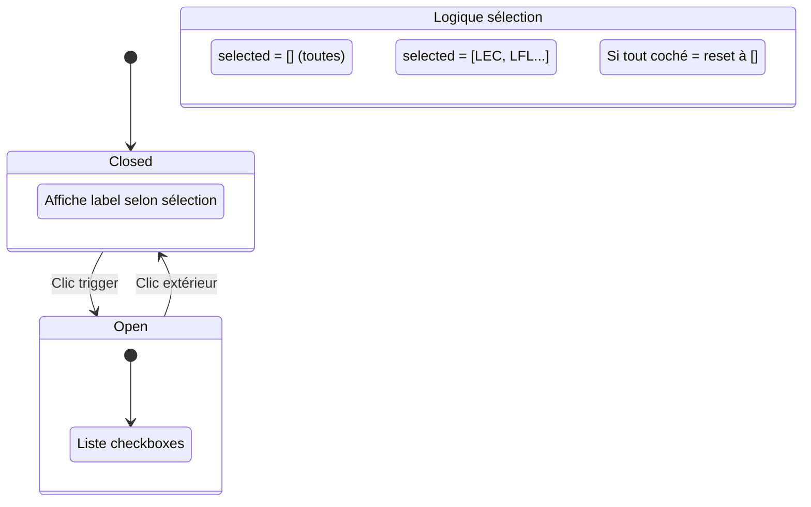
```mermaid
stateDiagram-v2
    [*] --> Closed

    state Closed {
        ShowLabel: Affiche label selon sélection
    }

    Closed --> Open: Clic trigger

    state Open {
        [*] --> ShowList
        ShowList: Liste checkboxes
    }

    Open --> Closed: Clic extérieur

    state "Logique sélection" as Selection {
        AllSelected: selected = [] (toutes)
        SomeSelected: selected = [LEC, LFL...]
        NoneToAll: Si tout coché = reset à []
    }
```

### Logique "Toutes les ligues"

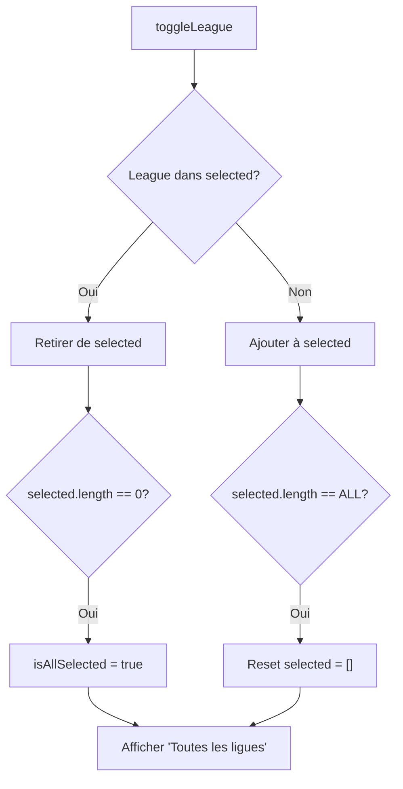
```mermaid
flowchart TD
    A[toggleLeague] --> B{League dans selected?}

    B -->|Oui| C[Retirer de selected]
    B -->|Non| D[Ajouter à selected]

    C --> E{selected.length == 0?}
    D --> F{selected.length == ALL?}

    E -->|Oui| G["isAllSelected = true"]
    F -->|Oui| H["Reset selected = []"]

    G --> I[Afficher 'Toutes les ligues']
    H --> I
```

---

## 7. Player Edit Row

**Fichier:** `src/components/admin/PlayerEditRow.tsx`

Édition inline avec mode display/edit.

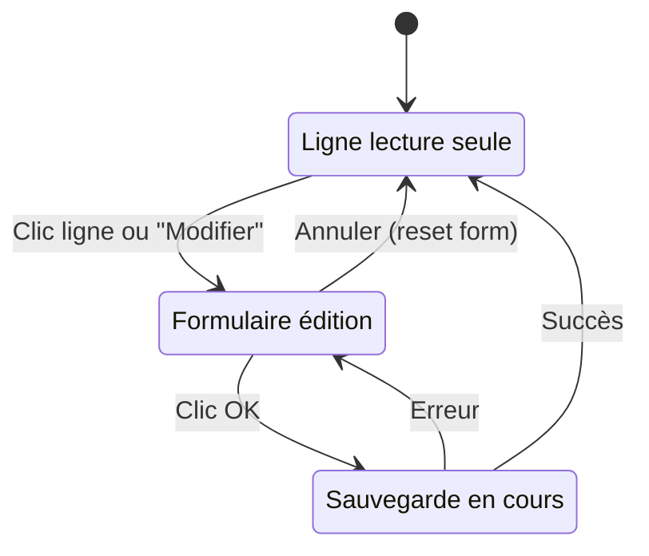
```mermaid
stateDiagram-v2
    [*] --> Display

    Display: Ligne lecture seule
    Edit: Formulaire édition
    Saving: Sauvegarde en cours

    Display --> Edit: Clic ligne ou "Modifier"

    Edit --> Display: Annuler (reset form)
    Edit --> Saving: Clic OK

    Saving --> Display: Succès
    Saving --> Edit: Erreur
```

### Logique de sauvegarde

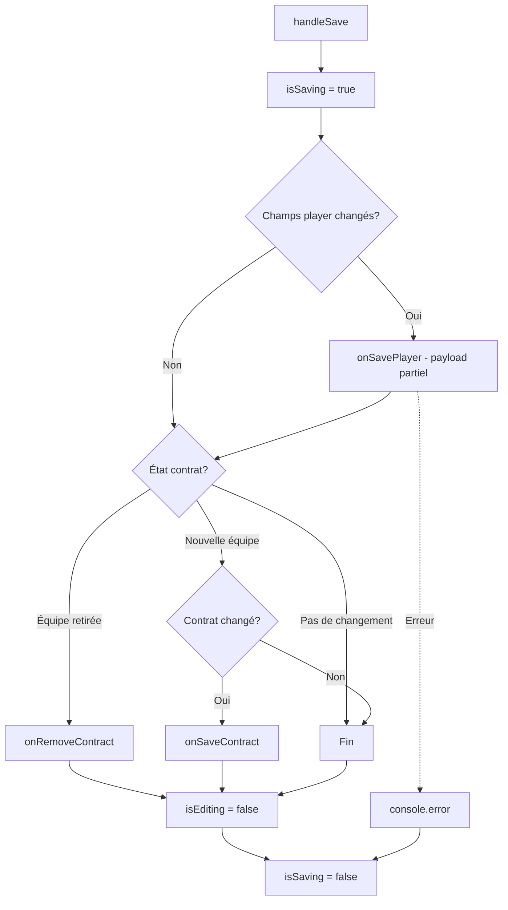
```mermaid
flowchart TD
    A[handleSave] --> B[isSaving = true]

    B --> C{Champs player changés?}
    C -->|Oui| D[onSavePlayer - payload partiel]
    C -->|Non| E{État contrat?}
    D --> E

    E -->|Nouvelle équipe| F{Contrat changé?}
    E -->|Équipe retirée| G[onRemoveContract]
    E -->|Pas de changement| H[Fin]

    F -->|Oui| I[onSaveContract]
    F -->|Non| H

    G --> J[isEditing = false]
    I --> J
    H --> J

    J --> K[isSaving = false]

    D -.->|Erreur| L[console.error]
    L --> K
```

---

## 8. SearchDropdown

**Fichier:** `src/components/dashboard/SearchDropdown.tsx`

Dropdown générique avec recherche et lazy loading.

```mermaid
stateDiagram-v2
    [*] --> Closed

    state Closed {
        Empty: Placeholder
        HasSelection: Affiche items sélectionnés
    }

    Closed --> Open: Clic trigger

    state Open {
        [*] --> CheckCache

        CheckCache --> Loading: items vide
        CheckCache --> Ready: items en cache

        Loading --> Ready: fetch OK
        Loading --> Ready: fetch erreur (items = [])

        state Ready {
            ShowAll: Liste complète
            Filtered: Liste filtrée
            NoResults: Aucun résultat
        }

        ShowAll --> Filtered: Saisie recherche
        Filtered --> ShowAll: Effacer recherche
        Filtered --> NoResults: 0 résultats
    }

    Open --> Closed: Clic extérieur
    Open --> Closed: Sélection item

    Ready --> Loading: refreshKey change
```

### Gestion des erreurs fetch

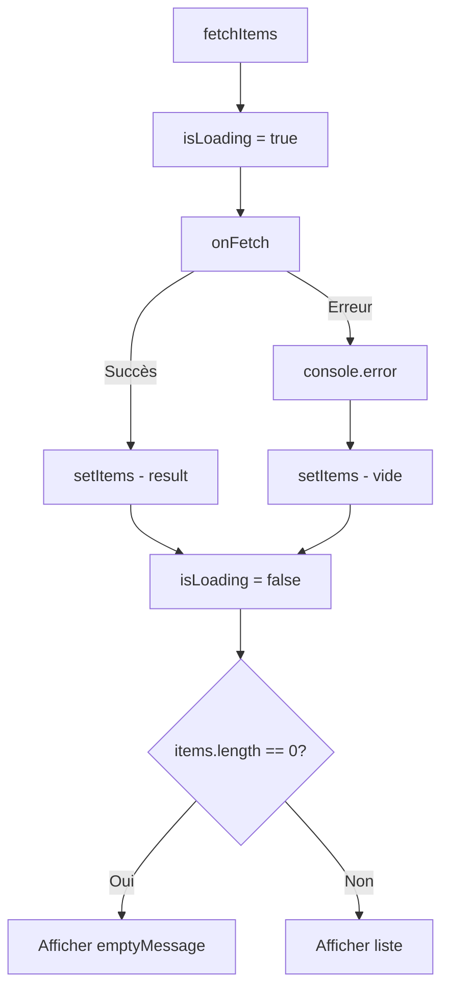
```mermaid
flowchart TD
    A[fetchItems] --> B[isLoading = true]
    B --> C[onFetch]

    C -->|Succès| D[setItems - result]
    C -->|Erreur| E[console.error]
    E --> F[setItems - vide]

    D --> G[isLoading = false]
    F --> G

    G --> H{items.length == 0?}
    H -->|Oui| I[Afficher emptyMessage]
    H -->|Non| J[Afficher liste]
```

---

## 9. Pattern Async Générique

Pattern commun pour les opérations asynchrones.

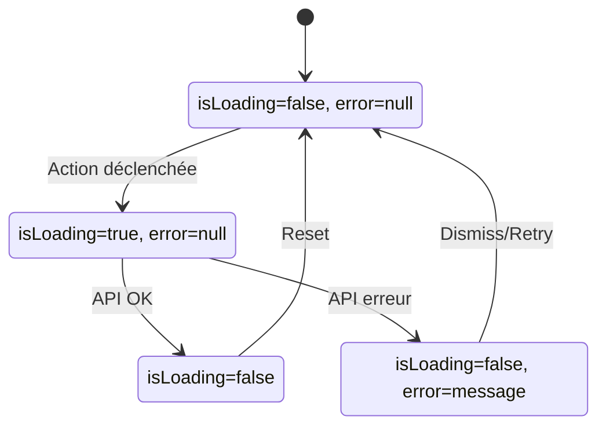
```mermaid
stateDiagram-v2
    [*] --> Idle

    Idle: isLoading=false, error=null

    Idle --> Loading: Action déclenchée

    Loading: isLoading=true, error=null

    Loading --> Success: API OK
    Loading --> Error: API erreur

    Success: isLoading=false
    Error: isLoading=false, error=message

    Success --> Idle: Reset
    Error --> Idle: Dismiss/Retry
```

### Template d'implémentation

```typescript
const [isLoading, setIsLoading] = useState(false)
const [error, setError] = useState<string | null>(null)

const handleAction = async () => {
  setIsLoading(true)
  setError(null)

  try {
    await apiCall()
    // Succès: fermer modal, reset form, etc.
  } catch (err) {
    setError(err instanceof Error ? err.message : 'Erreur inconnue')
  } finally {
    setIsLoading(false)
  }
}
```

---

## 10. Leaderboard - Expansion

**Fichiers:** `src/components/dashboard/TeamLeaderboard/index.tsx`, `PlayerLeaderboard/index.tsx`

Liste avec expansion multiple.

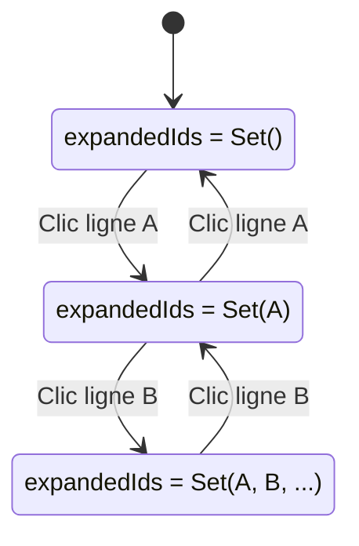
```mermaid
stateDiagram-v2
    [*] --> AllCollapsed

    AllCollapsed: expandedIds = Set()

    AllCollapsed --> OneExpanded: Clic ligne A
    OneExpanded --> AllCollapsed: Clic ligne A

    OneExpanded: expandedIds = Set(A)

    OneExpanded --> MultiExpanded: Clic ligne B
    MultiExpanded --> OneExpanded: Clic ligne B

    MultiExpanded: expandedIds = Set(A, B, ...)
```

### Réorganisation des données affichées

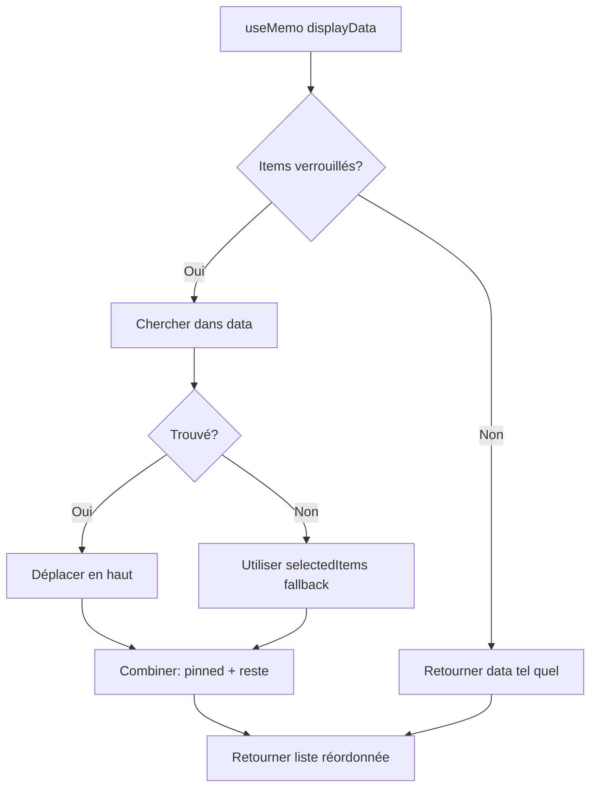
```mermaid
flowchart TD
    A[useMemo displayData] --> B{Items verrouillés?}

    B -->|Non| C[Retourner data tel quel]

    B -->|Oui| D[Chercher dans data]
    D --> E{Trouvé?}

    E -->|Oui| F[Déplacer en haut]
    E -->|Non| G[Utiliser selectedItems fallback]

    F --> H[Combiner: pinned + reste]
    G --> H
    H --> I[Retourner liste réordonnée]
    C --> I
```

---

## Résumé des composants

| Composant | Type d'état | Complexité | Patterns clés |
|-----------|-------------|------------|---------------|
| TwoFactorSetup | useState (machine) | Haute | Wizard multi-étapes, validation async |
| AuthContext | Context + useState | Moyenne | État global, refresh auto, 2FA |
| DashboardStore | Zustand | Haute | Sélection max 2, lock, dates |
| DateRangePicker | useState + ref | Moyenne | Dropdown, validation dates |
| LeagueDropdown | useState + ref | Basse | Multi-select, logique "toutes" |
| PlayerEditRow | useState | Moyenne | Toggle mode, save partiel |
| SearchDropdown | useState + refs | Haute | Lazy load, recherche, cache |
| Leaderboards | useState + useMemo | Moyenne | Expansion multiple, réordonnancement |

---

## Vue d'ensemble du flux de données

```mermaid
flowchart TB
    subgraph Global["État Global"]
        Auth[AuthContext]
        Dashboard[DashboardStore]
        Theme[ThemeStore]
    end

    subgraph Pages["Pages"]
        LolDash[LolDashboard]
        AdminPlayers[AdminPlayersPage]
        Profile[ProfilePage]
    end

    subgraph Composants["Composants Stateful"]
        TwoFA[TwoFactorSetup]
        EditRow[PlayerEditRow]
        Search[SearchDropdown]
        DatePicker[DateRangePicker]
        LeagueDrop[LeagueDropdown]
    end

    Auth --> Pages
    Dashboard --> LolDash
    Theme --> Pages

    LolDash --> Search
    LolDash --> DatePicker
    LolDash --> LeagueDrop
    Dashboard --> Search

    AdminPlayers --> EditRow
    Profile --> TwoFA
    Auth --> TwoFA
```
